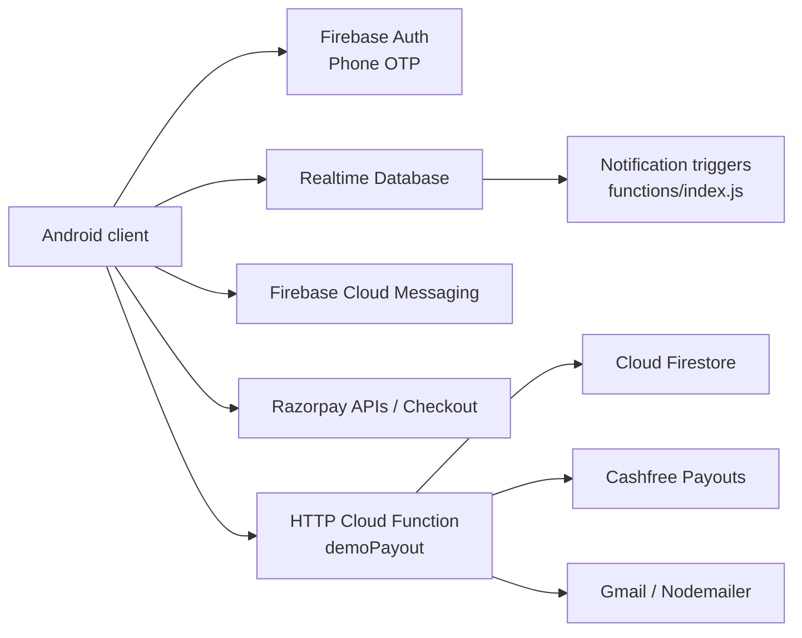

# BookMyTicket

Android ticketing and access-validation application for tourists, place administrators, and parking administrators. The app combines phone OTP authentication, QR ticket purchase and validation, vehicle entry, Firebase-backed notifications, and payout reporting in one role-aware client.

[](app/build.gradle.kts)
[](app/build.gradle.kts)
[](firebase.json)
[](#project-status)

> This repository is a prototype, not a production-ready payment system. Read [Known Limitations](docs/KNOWN_LIMITATIONS.md) before deploying.

## What it does

| Role | Main capabilities |
| --- | --- |
| Tourist | OTP login, browse places, buy and download QR tickets, manage vehicles, receive notifications |
| Place admin | Configure a place and bank details, scan tickets, review history, notifications, reports |
| Parking admin | Configure parking, scan or manually enter vehicles, manage pricing and dashboard activity |

## Architecture



The Android code is feature-oriented:

```text
com.example.bookmyticket
├── auth / security / core
├── model / notification / ui
├── features/{payment,reports,scanner,settings,tickets}
└── roles/{tourist,placeadmin,parkingadmin}
```

See [Architecture](docs/ARCHITECTURE.md), [Database Schema](docs/DATABASE_SCHEMA.md), and [Design Decisions](docs/DESIGN_DECISIONS.md).

## Quick start

Requirements: Android Studio, JDK 17 or a compatible AGP 8.6 toolchain, Android SDK 34, Node.js 22, and Firebase CLI for backend work.

```powershell
git clone https://github.com/shashank35i/BookMyTicket.git
cd BookMyTicket
.\gradlew.bat app:assembleDebug
.\gradlew.bat app:testDebugUnitTest
```

Open the project in Android Studio, select a device, and run `app`. Firebase phone authentication must be configured for the app package and signing certificate. Complete instructions are in [Setup](docs/SETUP.md).

## Backend and API

- `payouts/` is the only Cloud Functions codebase wired into `firebase.json`.
- `functions/index.js` contains notification triggers but is not currently deployable through that configuration.
- The payout function is state-changing and currently demo-specific. Do not call it against real data without reviewing the implementation.

Read [API Documentation](docs/API.md) and import the [Postman collection](postman/BookMyTicket.postman_collection.json).

## Data model

The Android client primarily uses Firebase Realtime Database nodes such as `users`, `tickets`, `vehicle_details`, `placeadmin`, `parkingadmins`, `payments`, `payouts`, `qrHistory`, and notification feeds. The payout function separately reads Firestore collections `payouts` and `payout_logs`. These are distinct stores despite overlapping names.

See the field-level [Database Schema](docs/DATABASE_SCHEMA.md).

## Screenshots and demo

Runtime screenshots and a demo GIF have not yet been captured from a test device. The repository includes product artwork below, but it is not presented as runtime evidence.


Follow the reproducible [screenshot checklist](docs/screenshots/README.md) before adding release media.

## Verification

The current source has been verified with:

```powershell
.\gradlew.bat app:assembleDebug
.\gradlew.bat app:testDebugUnitTest
```

Android lint currently reports known pre-existing issues. Load-test assets and the evidence record are in [Load Testing](docs/LOAD_TEST_RESULTS.md).

## Sample access

Authentication uses Firebase phone OTP, so there is no safe universal username/password pair. Use Firebase Authentication test phone numbers and fictional data as described in [Sample Credentials](docs/SAMPLE_CREDENTIALS.md). Never publish a real OTP, payment credential, bank account, or service secret.

## Project status

- Source repository: <https://github.com/shashank35i/BookMyTicket>
- Live Android deployment: **not currently published or verified**
- Public API deployment: **not currently verified**

This explicit status prevents a source-code URL or inferred Firebase endpoint from being misrepresented as a live production service.

## Documentation

- [Setup](docs/SETUP.md)
- [Architecture](docs/ARCHITECTURE.md)
- [Database Schema](docs/DATABASE_SCHEMA.md)
- [API Documentation](docs/API.md)
- [Design Decisions](docs/DESIGN_DECISIONS.md)
- [Known Limitations](docs/KNOWN_LIMITATIONS.md)
- [Future Improvements](docs/ROADMAP.md)
- [Load-test Results](docs/LOAD_TEST_RESULTS.md)
- [Sample Credentials](docs/SAMPLE_CREDENTIALS.md)

## License

No license file is currently present. Until one is added, the repository remains all-rights-reserved by default.
