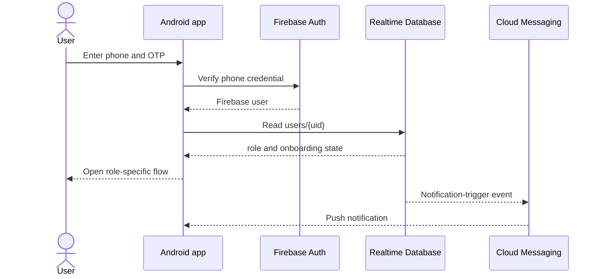

# Architecture

## System context

BookMyTicket is a native, single-module Android application. Activities are grouped by user role, while cross-role workflows are grouped by feature. Firebase Authentication establishes identity; Firebase Realtime Database is the Android app's main operational store; Firebase Cloud Messaging delivers notifications.

## Android boundaries

| Package | Responsibility |
| --- | --- |
| `auth`, `security` | OTP authentication, session creation, SMS app signature |
| `core` | Application initialization and launch/session routing |
| `roles.*` | Screens exclusive to tourist, place-admin, or parking-admin workflows |
| `features.*` | Cross-role payment, reporting, scanning, settings, and ticket workflows |
| `model` | Firebase-compatible data objects |
| `notification` | FCM token and Android notification services |
| `ui` | Reusable custom views |

The app uses Activities and XML layouts rather than a repository/domain/ViewModel layering model. Firebase references are currently opened directly from Activities.

## Backend boundaries

Two JavaScript locations exist:

1. `payouts/` is configured as Firebase codebase `payouts`. Its `demoPayout` HTTP handler reads Firestore, calls Cashfree, writes a payout log, generates a PDF, and sends email.
2. `functions/index.js` defines Realtime Database notification triggers. It is not listed as a functions source in `firebase.json`, so the current Firebase CLI configuration will not deploy it.

## Trust boundaries

- The Android client is untrusted and must not hold provider secrets.
- Firebase Security Rules must authorize every client database operation.
- Payment and bank-account provider calls should cross a trusted backend.
- HTTP payout operations require authentication, authorization, idempotency, validation, and audit logging before production use.
