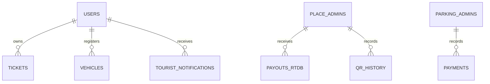

# Database Schema

This schema is reconstructed from application reads and writes. No checked-in Realtime Database rules or complete schema contract exists, so optionality and some nested fields may vary.

## Realtime Database

| Path | Key shape | Purpose / observed fields |
| --- | --- | --- |
| `users/{uid}` | Firebase UID | Identity/profile, role, phone/email, login/onboarding state, `fcmToken` |
| `tickets/{uid}/{ticketId}` | user + ticket | Ticket identity, place, amount, people counts, validity, QR data, status/timestamps |
| `vehicle_details/{uid}/...` | user + vehicle | `number`, `type`, `timestamp`, `isPrimary` |
| `placeadmin/{uid}` | admin UID | Place configuration, pricing, beneficiary/bank setup |
| `parkingadmins/{uid}` | admin UID | Parking configuration and pricing |
| `tourist_notifications/{uid}/{notificationId}` | recipient + notification | `type`, `seen`, ticket/vehicle/payment metadata |
| `placeadmin_notifications/{uid}/{notificationId}` | recipient + notification | `type`, `status`, `details`, `timestamp` |
| `admin_notifications/{uid}/...` | admin UID | Parking/admin events |
| `payments/...` | generated keys | Payment state for vehicle/ticket flows |
| `payouts/{placeId}/...` | place + payout | Payout/ticket aggregation used by Android dashboards |
| `qrHistory` / `qr_history` | mixed | QR validation history; both spellings appear in source |
| `realTimeData/{yyyy-MM-dd}` | date | Daily counters/statistics |

`.info/connected` is read to determine Realtime Database connectivity.

## Cloud Firestore

The `payouts/demoPayout` function uses:

| Collection | Observed fields |
| --- | --- |
| `payouts` | `userId`, `status`, `ticketId`, `baseAmount`, `totalPersons` |
| `payout_logs` | `userId`, `amount`, `date`, `status`, `transferId` or `error`, `createdAt` |

Realtime Database `payouts` and Firestore `payouts` are separate datasets.

## Required hardening

Define and version Firebase rules, indexes, validation constraints, ownership rules, allowed role transitions, and canonical naming before production. `firebase.json` currently references `firestore.rules` and `firestore.indexes.json`, but those files are absent.
